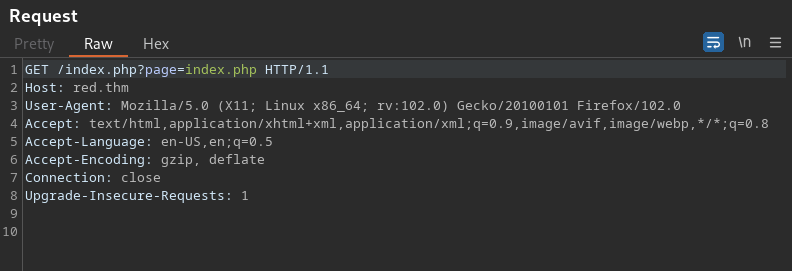
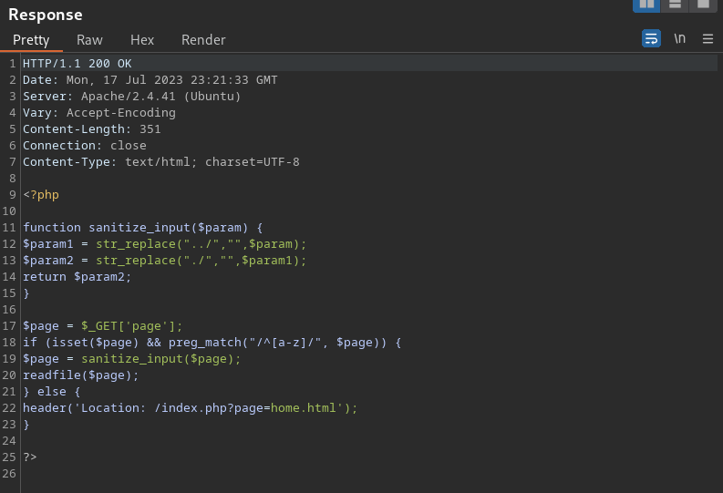
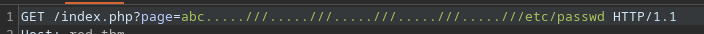
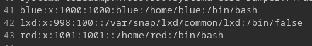
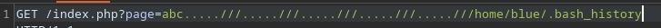
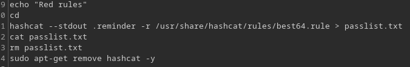
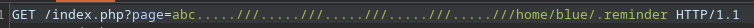
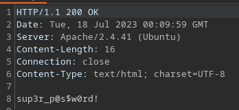

Captured with burp and sent to repeater  - change home.html  to index.php

  

made .reminder and ran the hashcat command from the history locally

gives a list of versions of the password

try these with ssh?
