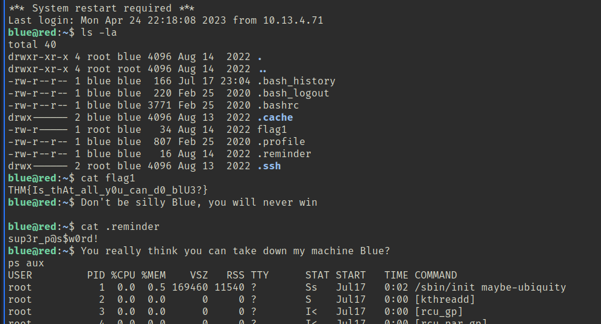
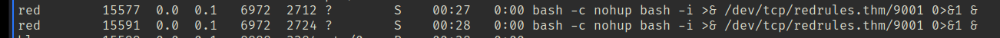
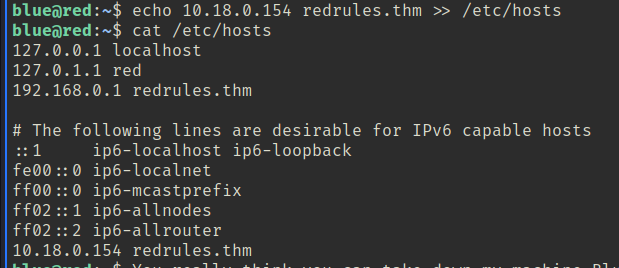
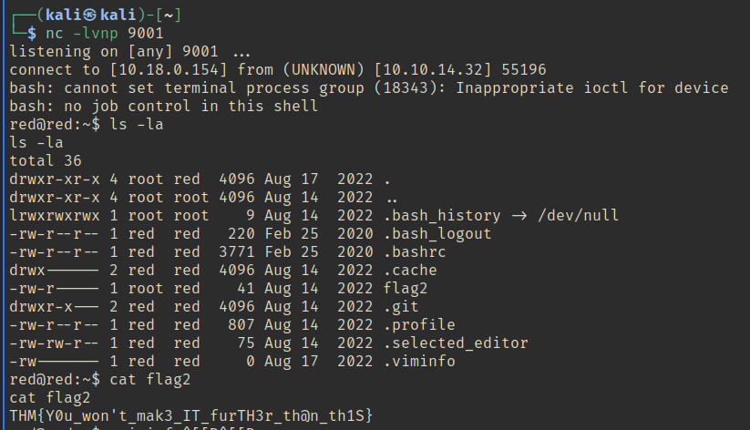

found user flag

strange messages popping up

Strange stuff happening, messages and you’re thrown out of the machine with password reset!
Trying to find by listing processes.

That’s interesting!

Did this several times and pinged after getting the wrong ip, but suddenly it connected… seemed very random but it was shortly after that ping. (I did also wget LinEnum.sh to /tmp but it didn’t find anything.)

