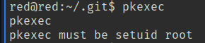
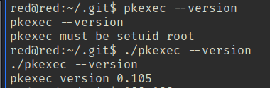
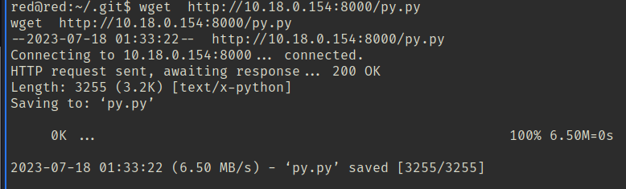
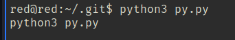
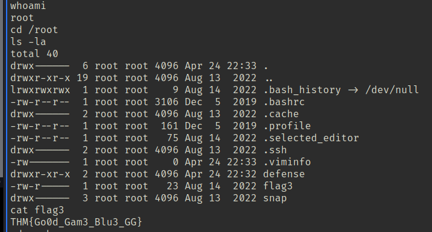

found a file called pkexec in .git folder and googled pkexec exploit, CVE-2021-4034.

“CVE-2021-4034 exploit python” gives https://github.com/joeammond/CVE-2021-4034.

there seem to be one  pkexec in the path and another in  the .git dir

Had to edit the file since it wasn’t in the dir in the script.

