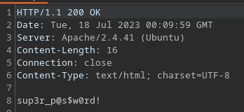

Captured with burp and sent to repeater  - change home.html  to index.php

/burp1.png)

/burp2.png)

/burp3.png)

/burp4.png)  

/burp5.png)

/burp6.png)

/burp7.png)

made .reminder and ran the hashcat command from the history locally

gives a list of versions of the password

try these with ssh?
