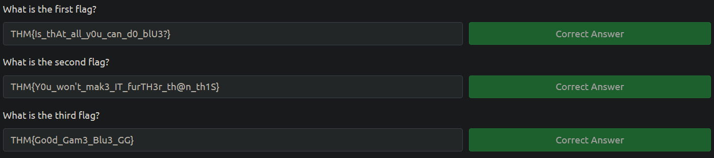

/root/defense  dir:

 cat backup.sh
```sh
#!/bin/bash
/usr/bin/chattr -a /etc/hosts
/usr/bin/cp /root/defense/hosts /etc/hosts
/usr/bin/chmod 646 /etc/hosts
/usr/bin/chattr +a /etc/hosts
```

cat blue_history
```sh
echo "Red rules"
cd
hashcat --stdout .reminder -r /usr/share/hashcat/rules/best64.rule > passlist.txt
cat passlist.txt
rm passlist.txt
sudo apt-get remove hashcat -y
```

cat change_pass.sh
```sh
#!/bin/bash
n=$((1 + $RANDOM % 7))
if [ $n -eq 1 ]; then
            /usr/bin/echo 'blue:!dr0w$s@p_r3pus' | /usr/sbin/chpasswd
elif [ $n -eq 2 ]; then
            /usr/bin/echo 'blue:sup3r_p@s$w0rd!123' | /usr/sbin/chpasswd
elif [ $n -eq 3 ]; then
            /usr/bin/echo 'blue:sup3r_p@s$w0rd!9' | /usr/sbin/chpasswd
elif [ $n -eq 4 ]; then
            /usr/bin/echo 'blue:thesup3r_p@s$w0rd!' | /usr/sbin/chpasswd
elif [ $n -eq 5 ]; then
            /usr/bin/echo 'blue:sup3r_p@s$w0sup3r_p@s$w0' | /usr/sbin/chpasswd
elif [ $n -eq 6 ]; then
            /usr/bin/echo 'blue:sup3r_p@s$w0!' | /usr/sbin/chpasswd
else
            /usr/bin/echo 'blue:sup3r_p@s$w0rd!23' | /usr/sbin/chpasswd
fi
```

cat hosts
```sh
127.0.0.1 localhost
127.0.1.1 red
192.168.0.1 redrules.thm

# The following lines are desirable for IPv6 capable hosts
::1         ip6-localhost ip6-loopback
fe00::0 ip6-localnet
ff00::0 ip6-mcastprefix
ff02::1 ip6-allnodes
ff02::2 ip6-allrouter
```

cat kill_sess.sh
```sh
#!/bin/bash
for i in $(ps aux | grep blue | grep ' pts' | grep -v root | awk '{print $7}')
do
            /usr/bin/echo "Say Bye Bye to your Shell Blue and that password" > /dev/$i
            /usr/bin/killall -u blue
done
```

cat talk.sh
```sh
#!/bin/bash
elements=("You really think you can take down my machine Blue?" "I really didn't think you would make it this far" "I recommend you leave Blue or I will destroy your shell" "You will never win Blue. I will change your password" "Red Rules, Blue Drools!" "Don't be silly Blue, you will never win" "Get out of my machine Blue!!" "I bet you are going to use linpeas and pspy, noob" "Roses are Red and you suck Blue" "La la la la la la la la la la la la la la la la" "Fine here is the root password WW91IGFyZSBhIGxvc2VyIEJsdWU=" "Here, I'll give you a hint, type exit and you'll be granted a root shell" "There is no way you are going to own this machine" "Roses are Red, but violets aren’t blue, They’re purple, you dope. Now go get a clue." "No you are repeating yourself, you are repeating yourself" "Oh let me guess, you are going to go to the /tmp or /dev/shm directory to run linpeas? Yawn" "Oh let me guess, you are going to go to the /tmp or /dev/shm directory to run Pspy? Yawn" "Fine fine, just run sudo -l and then enter this password WW91IHJlYWxseSBzdWNrIGF0IHRoaXMgQmx1ZQ==")
num_elements=${#elements[@]}
n=$(($RANDOM % num_elements))
for i in $(ps aux | grep blue | grep ' pts' | grep -v root | awk '{print $7}')
do
            /usr/bin/echo "${elements[n]}" > /dev/$i
done
```



